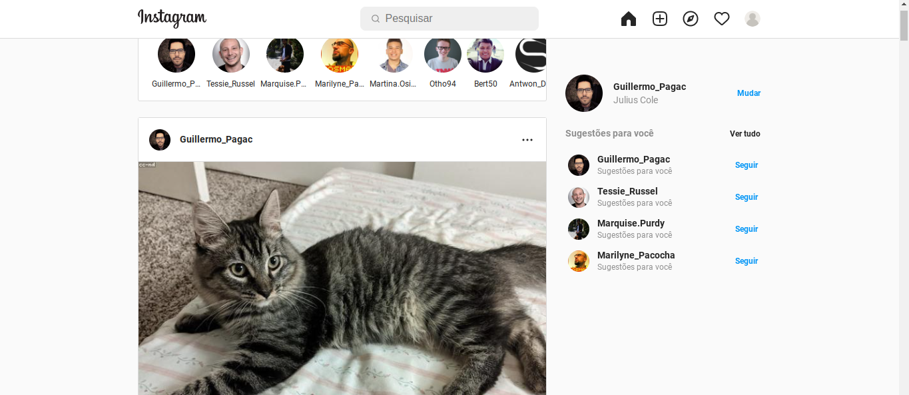
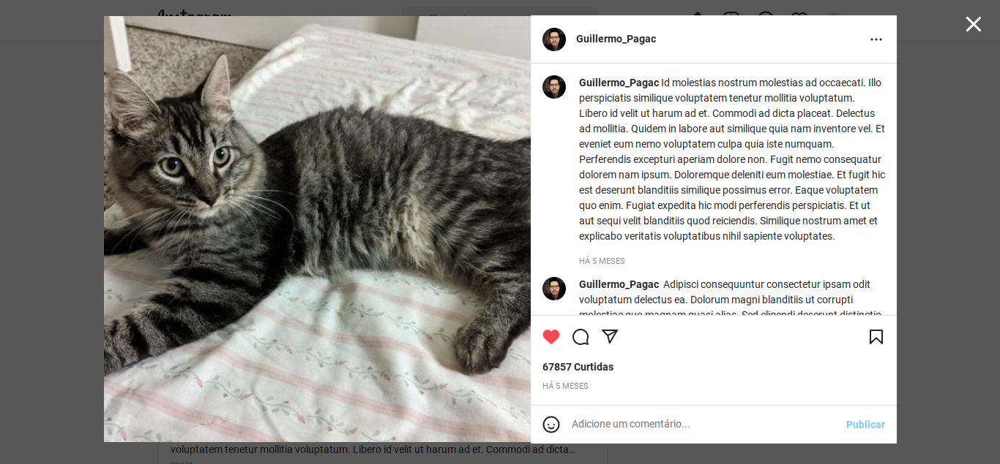
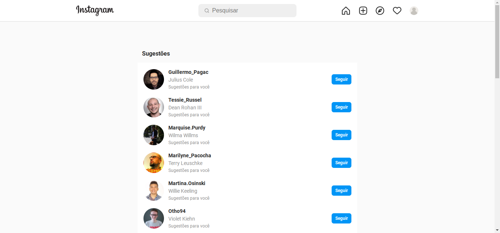

## Instagram clone

Um clone utilizando a tecnoliga React.js

## Netlify Deploy
[deploy](https://lighthearted-horse-65bbcb.netlify.app/)

## Tecnologia Utilizadas 
- [React](https://pt-br.reactjs.org/)
- [Redux](https://redux.js.org/)
- [Framer motion](https://www.framer.com/motion/)
- [react router v6](https://reactrouter.com/docs/en/v6/getting-started/overview)
- [Styled Components](https://styled-components.com/)

## Pages
- Home
  

- Comentarios por post
  

- Sugestoes
  

- Sugestoes de pesquisa
  

- Pagina de salvos do perfil
  

- Pagina da coleção de salvos
  
  

- Pagina de publicações do perfil
  

- Pagina de exploração do perifil
  

- Pagina de marcados
  